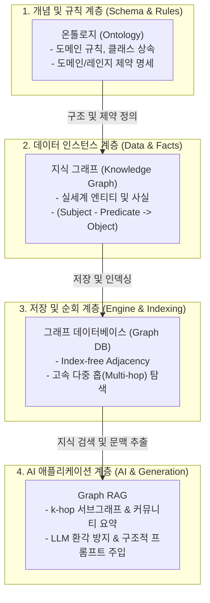

# 온톨로지, 지식 그래프, 그래프 DB, Graph RAG 완전 정복 가이드

이 문서는 **온톨로지(Ontology), 지식 그래프(Knowledge Graph), 그래프 데이터베이스(Graph DB), 그리고 Graph RAG**의 핵심 개념, 이론적 배경, 내부 동작 알고리즘 및 파이썬 기반 구현 방식을 총망라한 엔지니어링 가이드입니다.

---

## 1. 4대 핵심 기술의 위계 및 개요



### 1.1 기술별 역할 비교

| 구분 | 정의 | 핵심 역할 | 데이터 표현 예시 |
|---|---|---|---|
| **온톨로지 (Ontology)** | 도메인의 **개념(Class), 속성(Attribute), 관계 규칙(Relation Rule)**을 정의한 정형 명세서 | 지식의 일관성 검증, 타입 제약, 논리적 추론 지원 | `isCEOOf: Domain(Person) -> Range(Company)` |
| **지식 그래프 (Knowledge Graph)** | 온톨로지 스키마에 따라 **실제 엔티티(인스턴스)와 관계를 트리플(Triple)로 엮은 네트워크** | 실세계 사실(Fact)을 구조화하여 다중 연결 정보 제공 | `(Sam Altman, isCEOOf, OpenAI)` |
| **그래프 DB (Graph DB)** | 지식 그래프 데이터를 저장하고 **고속 그래프 순회(Traversal)를 제공하는 데이터베이스 엔진** | $O(1)$ 포인터 기반 관계 탐색 및 영속화 | Neo4j, Memgraph, Neptune (Cypher 지원) |
| **Graph RAG** | 비정형 텍스트 청크뿐 아니라 **지식 그래프의 연결 관계 및 커뮤니티 구조를 LLM에 주입하는 RAG** | 복잡한 다중 홉 관계 추론, 전역적 요약(Global Search) | 쿼리 $\rightarrow$ Seed 노드 $\rightarrow$ $k$-hop 서브그래프 $\rightarrow$ 프롬프트 |

---

## 2. 온톨로지와 데이터 모델링

### 2.1 RDF/OWL vs Labeled Property Graph (LPG)

지식을 컴퓨터가 이해할 수 있는 그래프 형태로 표현하는 방식에는 크게 두 가지 표준 진영이 있습니다.

```text
[RDF / OWL 모델]
(URI:Sam_Altman) ──[URI:isCEOOf]──> (URI:OpenAI)
※ 속성을 엣지에 직접 붙이기 어려워 별도 노드/리이피케이션 필요

[LPG (Labeled Property Graph) 모델]
(:Person {name: "Sam Altman", age: 39}) ──[:CEO_OF {since: 2019}]──> (:Company {name: "OpenAI"})
※ 노드와 엣지 모두에 Key-Value 속성(Properties)과 레이블(Label) 직접 부여
```

| 비교 항목 | RDF / OWL (시맨틱 웹) | LPG (엔터프라이즈 그래프) |
|---|---|---|
| **표준 및 기원** | W3C 표준 (학술, 시맨틱 웹) | 오픈소스 / 상용 그래프 DB (Neo4j 등) |
| **기본 단위** | `(Subject, Predicate, Object)` 트리플 | `Node`, `Edge(Relationship)`, `Properties` |
| **속성 부여** | 엣지에 직접 속성 부여가 어려움 (복잡함) | 노드와 엣지 모두에 유연한 Map 속성 저장 가능 |
| **스키마 엄격성** | 매우 엄격 (OWL 추론 엔진 기반 유효성 검사) | 스키마리스 또는 옵셔널 스키마 |
| **쿼리 언어** | SPARQL | Cypher, GQL, Gremlin |
| **주요 사용처** | 바이오/의학 온톨로지(MeSH, GO), 위키데이터 | 엔터프라이즈 AI, 사기 탐지, Graph RAG |

---

## 3. 그래프 데이터베이스와 순회 알고리즘

### 3.1 RDB vs Vector DB vs Graph DB

```text
[RDB (Join 폭탄)]        [Vector DB (유사도 검색)]      [Graph DB (Index-free Adjacency)]
Table A ──JOIN──> Table B   Query Vector ──Cosine──> Doc    Node A ──Pointer(O(1))──> Node B
(다중 홉 시 성능 급저하)    (구조적 관계/경로 추론 불가)    (깊은 연결 탐색도 지연 없이 순회)
```

1. **RDB (관계형 DB)**: 테이블 간 외래키(Foreign Key) 조인으로 관계를 해결합니다. 3~4홉 이상의 다중 조인이 발생하면 Cartesian 곱으로 인해 성능이 급격히 저하됩니다.
2. **Vector DB**: 고차원 벡터 임베딩 간의 코사인 유사도(HNSW, IVF 등)를 통해 "유사한 텍스트 청크"를 찾습니다. 하지만 A $\rightarrow$ B $\rightarrow$ C로 이어지는 **명시적 관계 경로 추론이나 집합적 요약에는 한계**가 있습니다.
3. **Graph DB**: 노드가 자신과 연결된 엣지의 메모리 주소(포인터)를 직접 소유하는 **Index-free Adjacency** 방식을 취하여, 전체 그래프 크기와 무관하게 국소 서브그래프를 $O(1)$ 단계로 빠르게 순회합니다.

### 3.2 $k$-hop BFS 서브그래프 탐색 알고리즘

Graph RAG에서 질의와 연관된 지식을 추출할 때 가장 기본이 되는 알고리즘은 **BFS(너비 우선 탐색)** 기반의 $k$-hop 서브그래프 추출입니다.

```mermaid
flowchart LR
    Seed(("Seed Node\n(OpenAI)"))
    Hop1_1["Entity: GPT-4\n(LanguageModel)"]
    Hop1_2["Entity: Sam Altman\n(Person)"]
    Hop2_1["Entity: Python\n(Language)"]

    Seed -- "[DEVELOPED]" --> Hop1_1
    Seed <-- "[CEO_OF]" -- Hop1_2
    Hop1_1 -- "[SUPPORTS]" --> Hop2_1

    classDef seed fill:#ff9999,stroke:#333,stroke-width:2px;
    classDef hop1 fill:#99ccff,stroke:#333,stroke-width:1px;
    classDef hop2 fill:#ccffcc,stroke:#333,stroke-width:1px;

    class Seed seed;
    class Hop1_1,Hop1_2 hop1;
    class Hop2_1 hop2;
```

- **시간 복잡도**: 평균 연결 차수를 $d$, 홉 수를 $k$라 할 때 $O(d^k)$.
- **순환 참조(Cycle) 방지**: 그래프 내 사이클($A \rightarrow B \rightarrow A$)로 인한 무한 루프를 막기 위해 반드시 `visited` 집합(Set)을 유지해야 합니다.

---

## 4. Graph RAG 핵심 아키텍처

기존 Naive RAG(Vector Search)의 주요 문제점은 다음과 같습니다:
- **정보 단절 (Siloed Information)**: 여러 문서에 흩어진 파편화된 사실들의 연결고리를 찾지 못함.
- **전역 요약 불가 (Global Summary Failure)**: *"이 전체 코퍼스의 주요 주제 3가지는 무엇인가?"*와 같은 광범위한 질문에 대해 개별 청크 유사도 검색만으로는 답변 불가능.

Graph RAG는 이를 해결하기 위해 두 가지 검색 모드를 제공합니다.

### 4.1 Local Search vs Global Search (Microsoft GraphRAG)

| 구분 | Local Search (지역 검색) | Global Search (전역 검색) |
|---|---|---|
| **목적** | 특정 개체 및 주변 관계에 대한 깊이 있는 사실 질의 | 전체 코퍼스를 아우르는 주제형/요약형 거시적 질의 |
| **대표 질문** | *"Sam Altman이 이끄는 회사가 개발한 모델은?"* | *"이 문서군 전체에서 지적하는 주요 보안 위협 요소는?"* |
| **인덱싱 기법** | 개체(Entity), 관계(Relation), 클레임(Claim) 추출 | 그래프 클러스터링(**Leiden 알고리즘**) $\rightarrow$ 계층별 커뮤니티 요약문 사전 생성 |
| **검색 방식** | 질의 $\rightarrow$ Seed 엔티티 식별 $\rightarrow$ $k$-hop 서브그래프 추출 $\rightarrow$ 프롬프트 구성 | 질의 $\rightarrow$ 계층별 **커뮤니티 요약 보고서**를 Map-Reduce 방식으로 취합 요약 |

---

## 5. 파이썬 기반 핵심 구현 (Step-by-Step Code)

### 5.1 온톨로지 제약(Ontology Rule) 검증 지식 그래프

```python
from collections import defaultdict, deque
from typing import Any, Literal
from pydantic import BaseModel, Field


class Entity(BaseModel):
    """Knowledge Graph Entity (Node)"""

    id: str
    name: str
    entity_type: str
    properties: dict[str, Any] = Field(default_factory=dict)


class Relation(BaseModel):
    """Knowledge Graph Directed Relation (Edge)"""

    source_id: str
    target_id: str
    relation_type: str
    properties: dict[str, Any] = Field(default_factory=dict)


class RelationRule(BaseModel):
    """온톨로지 관계 규칙 (도메인/레인지 제약조건)"""

    relation_type: str
    allowed_source_types: set[str]
    allowed_target_types: set[str]


class KnowledgeGraph:
    """온톨로지 규칙 검증 및 인접 리스트 인덱싱을 지원하는 지식 그래프"""

    def __init__(self, ontology_rules: list[RelationRule] | None = None) -> None:
        self.entities: dict[str, Entity] = {}
        self.relations: list[Relation] = []
        self._adj_out: dict[str, list[Relation]] = defaultdict(list)
        self._adj_in: dict[str, list[Relation]] = defaultdict(list)
        self.rules: dict[str, RelationRule] = (
            {r.relation_type: r for r in ontology_rules} if ontology_rules else {}
        )

    def add_entity(self, entity: Entity) -> None:
        self.entities[entity.id] = entity

    def add_relation(self, relation: Relation) -> None:
        source = self.entities.get(relation.source_id)
        target = self.entities.get(relation.target_id)

        if not source or not target:
            raise ValueError(
                f"Both source({relation.source_id}) and target({relation.target_id}) must exist."
            )

        # 온톨로지 규칙 검증
        if relation.relation_type in self.rules:
            rule = self.rules[relation.relation_type]
            if source.entity_type not in rule.allowed_source_types:
                raise ValueError(
                    f"Invalid source type '{source.entity_type}' for {relation.relation_type}. "
                    f"Allowed: {rule.allowed_source_types}"
                )
            if target.entity_type not in rule.allowed_target_types:
                raise ValueError(
                    f"Invalid target type '{target.entity_type}' for {relation.relation_type}. "
                    f"Allowed: {rule.allowed_target_types}"
                )

        self.relations.append(relation)
        self._adj_out[relation.source_id].append(relation)
        self._adj_in[relation.target_id].append(relation)

    def get_entity(self, entity_id: str) -> Entity | None:
        return self.entities.get(entity_id)

    def get_neighbors(
        self, entity_id: str, direction: Literal["out", "in", "both"] = "both"
    ) -> list[tuple[Relation, Entity]]:
        neighbors: list[tuple[Relation, Entity]] = []

        if direction in ("out", "both"):
            for rel in self._adj_out.get(entity_id, []):
                tgt = self.entities.get(rel.target_id)
                if tgt:
                    neighbors.append((rel, tgt))

        if direction in ("in", "both"):
            for rel in self._adj_in.get(entity_id, []):
                src = self.entities.get(rel.source_id)
                if src:
                    neighbors.append((rel, src))

        return neighbors

    def find_subgraph(
        self, seed_entity_ids: list[str], max_hops: int = 1
    ) -> tuple[set[str], list[Relation]]:
        """BFS 기반 k-hop 서브그래프 탐색"""
        valid_seeds = [eid for eid in seed_entity_ids if eid in self.entities]
        if not valid_seeds:
            return set(), []

        visited_nodes: set[str] = set(valid_seeds)
        discovered_relations: list[Relation] = []
        seen_relation_keys: set[tuple[str, str, str]] = set()

        queue: deque[tuple[str, int]] = deque((eid, 0) for eid in valid_seeds)

        while queue:
            curr_node, current_hop = queue.popleft()
            if current_hop >= max_hops:
                continue

            for rel, neighbor in self.get_neighbors(curr_node, direction="both"):
                rel_key = (rel.source_id, rel.target_id, rel.relation_type)
                if rel_key not in seen_relation_keys:
                    seen_relation_keys.add(rel_key)
                    discovered_relations.append(rel)

                if neighbor.id not in visited_nodes:
                    visited_nodes.add(neighbor.id)
                    queue.append((neighbor.id, current_hop + 1))

        return visited_nodes, discovered_relations
```

### 5.2 Graph RAG Retriever 및 프롬프트 빌더

```python
class GraphRAGRetriever:
    """지식 그래프 기반 LLM 컨텍스트 검색기"""

    def __init__(self, graph: KnowledgeGraph) -> None:
        self.graph = graph

    def extract_seed_entities(self, query: str) -> list[str]:
        """질의에서 엔티티 이름 대소문자 매칭으로 Seed 노드 추출"""
        query_lower = query.lower()
        return [
            eid
            for eid, entity in self.graph.entities.items()
            if entity.name.lower() in query_lower
        ]

    def format_triples(self, relations: list[Relation]) -> list[str]:
        """Relation 리스트를 가독성 높은 문자열 트리플로 포맷팅"""
        formatted: list[str] = []
        for rel in relations:
            source = self.graph.get_entity(rel.source_id)
            target = self.graph.get_entity(rel.target_id)
            if source and target:
                formatted.append(
                    f"({source.name}: {source.entity_type}) -[{rel.relation_type}]-> ({target.name}: {target.entity_type})"
                )
        return formatted

    def retrieve_context(self, query: str, max_hops: int = 1) -> str:
        """질의를 바탕으로 LLM 프롬프트에 주입할 정형 컨텍스트 생성"""
        seed_ids = self.extract_seed_entities(query)
        if not seed_ids:
            return ""

        node_ids, relations = self.graph.find_subgraph(seed_ids, max_hops=max_hops)
        if not node_ids:
            return ""

        entities = [self.graph.entities[nid] for nid in sorted(node_ids)]
        triples = self.format_triples(relations)

        lines: list[str] = ["[Knowledge Graph Context]"]
        lines.append("Entities:")
        for entity in entities:
            lines.append(f"- {entity.name} ({entity.entity_type})")

        if triples:
            lines.append("\nRelationships:")
            for triple in triples:
                lines.append(f"- {triple}")

        return "\n".join(lines)
```

---

## 6. 요약 및 실무 적용 체크리스트

1. **온톨로지는 지식의 품질 게이트웨이**: 비정형 텍스트에서 LLM을 이용해 그래프를 추출(Triplets Extraction)할 때 온톨로지 규칙을 프롬프트나 유효성 검사기에 주입하면 오염된 지식과 환각 엔티티 생성을 획기적으로 줄일 수 있습니다.
2. **Hybrid RAG 구성 권장**: 실무에서는 Vector DB(텍스트 원문 청크 검색)와 Graph DB(구조적 사실 및 관계 검색)를 결합하는 **Hybrid Vector + Graph RAG**가 가장 높은 신뢰도와 답변 품질을 제공합니다.
3. **적절한 홉 수($k$) 설정**: 홉 수 $k$가 너무 크면($k \ge 3$) 노이즈 엔티티가 급증하고 컨텍스트 윈도우가 낭비되므로, 일반적으로 $1 \le k \le 2$ 범위를 권장합니다.
