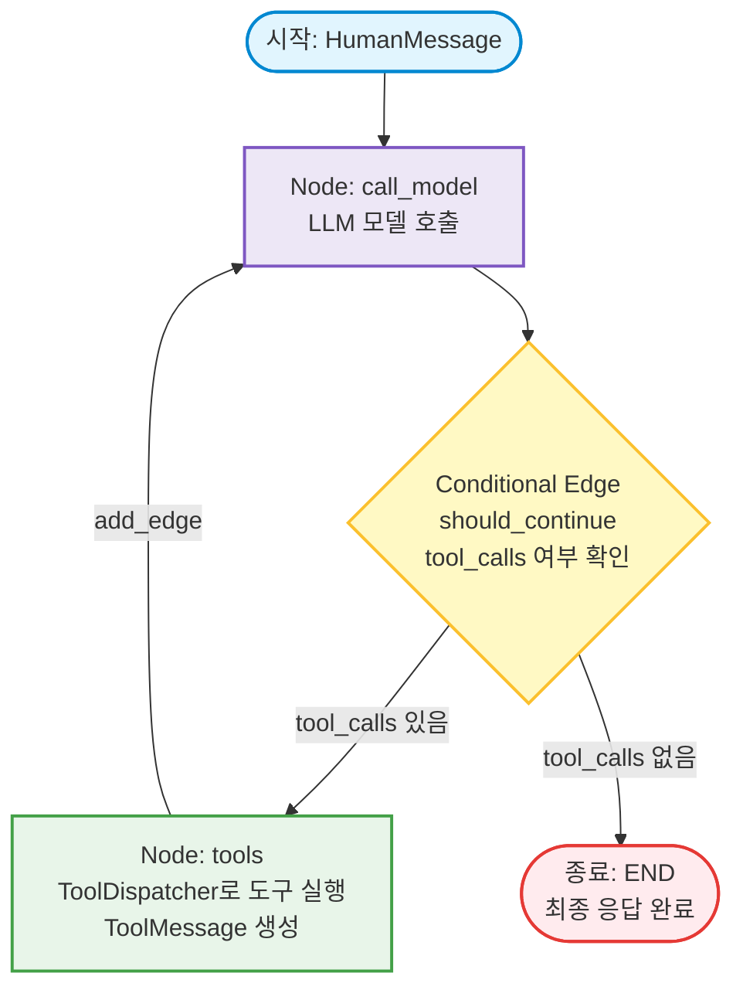

# LangGraph 기반 Tool Calling (도구 호출) 완전 정복 가이드

이 문서는 LangGraph와 `ToolDispatcher`를 활용한 **ReAct 에이전트의 도구 호출(Tool Calling) 메커니즘, 데이터 흐름, 메시지 라이프사이클**을 상세히 설명합니다.

---

## 1. ReAct (Reason + Act) 에이전트란?

> [!NOTE]
> **ReAct**는 **Re**asoning(추론/생각)과 **Act**ing(행동/실행)을 결합한 AI 에이전트 아키텍처 패턴입니다. *(웹 프레임워크인 React.js와는 무관한 AI 논문 기반 개념)*

### 1.1 왜 ReAct가 필요한가?
* **일반 LLM (단발성 응답)**: 질문을 받으면 학습된 기억만으로 즉시 한 번에 대답하므로, **최신 정보 부재, 복잡한 연산 오류(환각)**가 발생하기 쉽습니다.
* **ReAct 에이전트**: 사람처럼 **"생각(Thought)하고 $\rightarrow$ 도구로 행동(Action)하고 $\rightarrow$ 결과를 관찰(Observation)한 뒤 $\rightarrow$ 다시 생각"**하는 루프를 거쳐 최종 답을 도출합니다.

```text
┌────────────────────────────────────────────────────────┐
│  1. Thought (추론): "현재 상황을 분석하고 무엇을 할지 생각한다" │
│  2. Action  (행동): "필요한 외부 도구(함수, API 등)를 호출한다"│
│  3. Observe (관찰): "도구 실행 결과를 확인하고 상태를 갱신한다"│
└────────────────────────────────────────────────────────┘
```

### 1.2 우리 코드와의 1:1 매칭

| ReAct 개념 | 우리 코드 구현 | 역할 |
| :--- | :--- | :--- |
| **Thought + Action** | **`call_model` 노드** | LLM이 생각을 거쳐 어떤 도구를 호출할지(`AIMessage.tool_calls`) 결정 |
| **Action 실행 & Observe** | **`tools` 노드** | `ToolDispatcher`로 실제 함수를 실행하고 결과(`ToolMessage`)를 관찰 |
| **루프 판단 / 분기** | **`should_continue` 엣지** | 더 실행할 도구가 남아있는지 확인 (남았으면 루프 반복, 끝났으면 `END`) |

---

## 2. Tool Calling(도구 호출)이란?

> [!NOTE]
> **핵심 개념**: LLM은 파이썬 코드를 직접 실행할 수 없습니다. 대신 **"어떤 함수를 어떤 인자(arguments)로 실행해달라"**는 구조화된 요청(JSON)을 만들고, 실제 실행은 애플리케이션(파이썬 런타임)이 담당합니다.

### 2.1 LangGraph 노드/엣지 구조 (Flowchart)



### 2.2 텍스트 기반 전체 데이터 흐름도

```text
[ 사용자: "10 + 25 계산해줘" ] (HumanMessage)
               │
               ▼
┌───────────────────────────────┐
│     Node: 'call_model'        │ ◄──────────────────────────┐
│  - LLM에게 대화 목록 전달       │                            │
│  - AIMessage(tool_calls) 생성  │                            │
└──────────────┬────────────────┘                            │
               │                                             │
               ▼                                             │
      /─────────────────\                                    │
     <  should_continue  >                                   │
      \─────────────────/                                    │
        │             │                                      │
 [tool_calls 있음]  [tool_calls 없음]                        │
        │             │                                      │
        ▼             └───────────────────► [ 종료: END ]    │
┌───────────────────────────────┐          (최종 텍스트 답변 완료) │
│        Node: 'tools'          │                            │
│  - ToolDispatcher.execute()   │                            │
│  - ToolMessage("35.0") 생성   │────────────────────────────┘
└───────────────────────────────┘
```

---

## 3. 메시지 유형 및 생성 주체

대화가 진행되는 동안 `state["messages"]`에는 3가지 핵심 메시지 타입이 순차적으로 누적됩니다:

| 순서 | 메시지 타입 | 생성 주체 | 핵심 필드 / 내용 | 설명 |
| :---: | :--- | :---: | :--- | :--- |
| **1** | `HumanMessage` | **사용자** | `content="Calculate 10 + 25"` | 사용자의 초기 질문 또는 요청 |
| **2** | `AIMessage` | **LLM** | `tool_calls=[{"name": "add", "args": {"a": 10, "b": 25}, "id": "call_1"}]` | LLM이 판단한 도구 실행 요청 |
| **3** | `ToolMessage` | **파이썬 (`tools` 노드)** | `content="35.0"`, `tool_call_id="call_1"` | 실제 파이썬 함수 실행 결과값 |
| **4** | `AIMessage` | **LLM** | `content="The result of 10 + 25 is 35.0."` | 도구 결과를 보고 완성한 최종 답변 |

> [!IMPORTANT]
> `ToolMessage`는 반드시 LLM이 전달해준 `tool_calls`의 `id`와 동일한 `tool_call_id`를 가져야 합니다. 그래야 LLM이 어떤 도구 호출에 대한 결과인지 정확히 매칭할 수 있습니다.

---

## 4. 핵심 컴포넌트별 코드 분석

### 4.1 `ToolDispatcher` ([tool_dispatcher.py](file:///Users/kimkyungpyo/Workspaces/playground/coding-tests/src/ai_practice/level1_basics/tool_dispatcher.py))
도구(파이썬 함수)의 등록, 스키마 추출, 안전한 실행을 전담하는 디스패처입니다.

```python
class ToolDispatcher:
    def register(self, func: Callable[..., Any], name: str | None = None) -> None:
        """파이썬 함수를 도구로 등록하고 OpenAI 호환 JSON Schema를 생성"""
        ...

    def execute(self, tool_call: ToolCall) -> ToolResult:
        """도구를 안전하게 실행 (예외 발생 시 error 상태 반환)"""
        tool = self._tools.get(tool_call.name)
        if tool is None:
            return ToolResult(
                tool_name=tool_call.name, status="error", error_message="Not found"
            )
        try:
            result = tool(**tool_call.arguments)
            return ToolResult(tool_name=tool_call.name, status="success", output=result)
        except Exception as e:
            return ToolResult(
                tool_name=tool_call.name, status="error", error_message=str(e)
            )
```

---

### 4.2 `ReAct Agent` 워크플로우 ([react_agent.py](file:///Users/kimkyungpyo/Workspaces/playground/coding-tests/src/ai_practice/level4_agents/react_agent.py))

#### ① `call_model` (모델 호출 노드)
현재까지의 메시지 목록을 LLM에 전달하여 응답을 받습니다.
```python
def call_model(state: AgentState) -> AgentState:
    # StateGraph의 add_messages 리듀서가 동작하도록 딕셔너리 형태로 반환
    return {"messages": [model.invoke(state["messages"])]}
```

#### ② `should_continue` (조건부 라우팅)
LLM의 마지막 응답 메시지에 `tool_calls`가 포함되어 있는지 확인합니다.
```python
def should_continue(state: AgentState) -> str:
    last_msg = state["messages"][-1]
    # tool_calls가 있으면 tools 노드로 분기, 없으면 종료(END)
    if getattr(last_msg, "tool_calls", None):
        return "tools"
    return END
```

#### ③ `tools` (도구 실행 노드)
LLM이 요청한 모든 `tool_calls`를 순회하며 실행하고 `ToolMessage`를 생성합니다.
```python
def tools(state: AgentState) -> AgentState:
    last_msg = state["messages"][-1]
    tool_messages = []

    for tc in last_msg.tool_calls:
        # 1. 실행 객체 생성
        call_obj = ToolCall(
            name=tc["name"],
            arguments=tc["args"],
            call_id=tc.get("id"),
        )
        # 2. ToolDispatcher로 실제 파이썬 함수 실행
        result = dispatcher.execute(call_obj)

        # 3. 성공/실패 여부에 따른 content 구성
        if result.status == "success":
            content = str(result.output)
        else:
            content = f"Error: {result.error_message}"

        # 4. ToolMessage 객체 생성 (tool_call_id 매핑 필수)
        tool_messages.append(ToolMessage(content=content, tool_call_id=tc.get("id")))

    # 5. messages 채널에 추가
    return {"messages": tool_messages}
```

#### ④ 그래프 조립 및 컴파일
```python
graph = StateGraph(AgentState)

# 노드 등록
graph.add_node("call_model", call_model)
graph.add_node("tools", tools)

# 엣지 연결
graph.set_entry_point("call_model")
graph.add_conditional_edges("call_model", should_continue)  # 분기 엣지
graph.add_edge("tools", "call_model")  # 피드백 루프

# HITL (Human-in-the-loop) 옵션 적용
interrupt_before = ["tools"] if interrupt_before_tools else None

return graph.compile(
    checkpointer=checkpointer,  # 다중 턴 대화 메모리 (MemorySaver 등)
    interrupt_before=interrupt_before,  # 도구 실행 전 일시 정지 설정
)
```

---

## 5. 고급 기능: 에러 복구 및 Human-in-the-Loop (HITL)

### 5.1 도구 실행 실패 시 자체 복구 (Self-Correction)
- LLM이 잘못된 인자를 전달하여 `TypeError` 등이 발생해도 프로그램이 멈추지 않습니다.
- `ToolDispatcher`가 에러를 잡아 `ToolMessage(content="Error: unexpected argument...")`로 반환합니다.
- 다음 턴의 `call_model`에서 LLM은 이 에러 메시지를 확인하고 **"인자 오류를 인지하고 처리했습니다"**라며 스스로 복구할 수 있습니다.

### 5.2 Human-in-the-Loop (사람의 승인 후 실행)
- 중요한 도구 실행 전 `interrupt_before=["tools"]`로 일시 중지합니다.
- 사용자는 `state = agent.get_state(config)`로 멈춘 상태(`state.next == ("tools",)`)를 확인한 뒤,
- `agent.invoke(None, config=config)`를 호출하여 실행을 안전하게 재개(Resume)할 수 있습니다.
